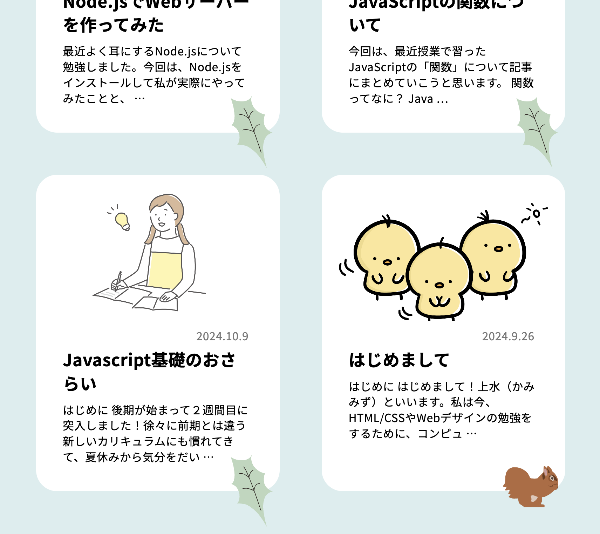

# 2024年7・8月_ブログ日和

🔗[ブログ日和 Webサイト](https://kanade.raindrop.jp/blog/)
 

## ▼作品概要

7・8月に授業と夏休みの課題で制作した、個人で執筆した記事がまとめられているブログサイトです。
 
 

## ▼コンセプト

### 積もる気づきが「北欧の冬景色」に
このサイトは、北欧の冬景色をテーマにデザインを考えました。北欧の優しくて温もりある雰囲気を取り入れるため、優しくて淡い色使いになるよう心がけ、植物や動物、鳥など自然を彷彿とさせるモチーフをところどころに散りばめました。

サイト名の「ブログ日和」や降り積もる雪のイメージには、「日々の気づきが少しずつ積み重なっていく」というメッセージが反映されています。
 
 

## ▼使用技術・ツール

WordPressを構築する際に、phpを使用しました。
 
 

## 💡記事のカテゴリーごとに異なるアイコンを表示
background: url() や content: url() を活用して、カテゴリーごとに異なるイラストのアイコンが表示されるようにしています。細かい部分にまで遊び心を取り入れることで、使っていて飽きない、わくわくするようなサイトになるよう工夫しました。また、視覚的なアイコンを使用することで、どこにどのカテゴリーの記事があるのか一目で分かるため、カテゴリー名が小さな字で表記されているよりも探しやすい設計になっています。

現時点では記事にまだ使われていないカテゴリーがあるため、2種類しか表示されていませんが、実際には全部で4種類のカテゴリーとイラストがあります。

<table align="center">
  <tr>
    <td align="center" style="padding-right: 80px;"></td>
    <td align="center" style="padding-right: 80px;"></td>
    <td align="center" style="padding-right: 80px;"></td>
    <td align="center"></td>
  </tr>
</table>

ま右サイドバーのカテゴリー一覧をそれぞれクリックすると、カテゴリーごとに絞られた検索結果が表示されます。

